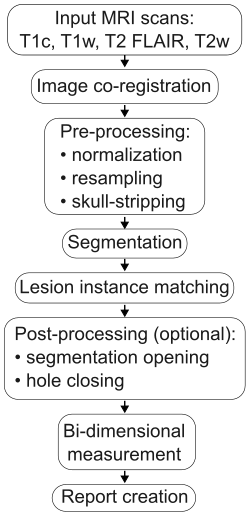
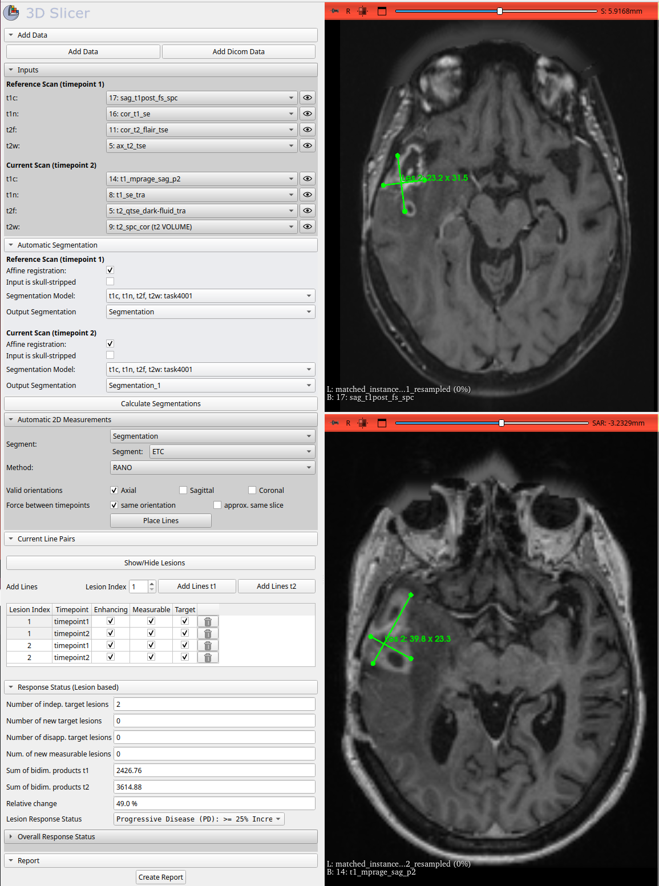

# Summary
The Response Assessment in Neuro-Oncology (RANO) criteria [@wen2023rano] are widely used to assess the treatment response of glioma patients in clinical trials.
RANO was introduced to improve reliability and reproducibility of response assessment, classifying patients into four categories: complete response, partial response, stable disease, and progressive disease.
The classification is primarily based on the change in tumor size and typically requires the identification of all tumor regions and the measurment of their dimensions on MRI scans.
While manual assessment is time-consuming and prone to inter- and intra-observer variability, automated methods can provide more consistent and efficient response assessment.
We present RANO-assist, a 3D Slicer extension for (semi-)automatic assessment of response to glioma.
RANO-assist allows for fully automatic respons assessment while also providing interactive tools for manual correction and validation of the results.

# Statement of need
Tools for automatic response assessment based on RANO criteria have been developed, for example [@chang2019automatic; @nalepa2023deep]. For a comprehensive review of 
existing methods, we refer the reader to [@shi2025automated].
However, existing tools are based on outdated RANO criteria [@wen2010updated] and do not allow for the interactive correction and validation of results.
Moreover, some tools are proprietary and not freely available to the research community.
RANO-assist is based on the recently updated RANO 2.0 criteria and provides a user-friendly interface for the assessment of treatment response.
The interactive tools allow the user to modify, add, and remove bi-dimensional measurements of tumor regions, specify measurable and non-measurable lesions, and provide additional information
such as the patient's clinical status, steroid dose, and other relevant information that influence the response assessment according to the RANO 2.0 criteria.

# Overview of RANO-assist
The key components of the RANO-assist pipeline are shown in figure \autoref{fig:pipeline}.

{ width=20% }

A snapshot of the user interface is shown in figure \autoref{fig:interface}.

{ width=100% }

RANO-assist includes a model for automatic segmentation of glioblastoma, which requires T1-contrast, native T1, T2-FLAIR, and T2-weighted MRI 
scans as input and returns an output segmentations containing up to 4 regions: enhancing tumor, edema, necrosis, and resection cavity. These inputs have to be provided for both time points (baseline and follow-up scan).
The model was trained on the BraTS challenge dataset [@de20242024]. Other segmentation models can be added to RANO-assist by the user.
After loading the image files (any formats supported by 3D Slicer), the user can select the corresponding scans and the
segmentation model from the drop-down menu and start the automatic segmentation process.

Based on the output segmentation, RANO-assist automatically places orthogonal line pairs representing the 
bi-dimensional measurements of the tumor regions. 

The default method "RANO", exhaustively searches for the optimal line pairs that maximize the bi-dimensional product.
"RANOopen 2D" and "RANOopen 3D" are alternative methods that apply a post-processing step to the selected segment by 
performing a morphological opening operation in 2D or 3D, respectively. 

Optionally, the user can restrict the orientation of the line pairs to specific anatomical directions, i.e., axial, sagittal, or coronal.
In addition, the user can enforce that line pairs in the second time point are confined to the same anatomical direction 
as the corresponding line pairs in the first time point. Similarly, the user can confine line pairs in the second time point
to slices that are within a certain distance from the corresponding slice in the first time point.

The user can interactively modify the line pairs, add new, or remove existing ones.
Additionally, the user can specify enhancing and non-enhancing lesions, whether they are measurable, and whether they 
are to be considered as target lesions according to the RANO 2.0 criteria.

Based on the bi-dimensional measurements, RANO-assist calculates the percentage change in tumor size and classifies the
patient's response according to the thresholds specified in the RANO 2.0 criteria.
The user can review the classification and manually adjust the response category if necessary. 

According to the RANO 2.0 criteria, the overall response status depends on additional factors such as the patient's 
clinical status and steroid dose. 
RANO-assist provides input fields for these factors and returns the final response category based on the RANO 2.0 criteria.

Finally, the user can export the results as a PDF report that includes 
bi-dimensional measurements with screenshots of the line pairs,
longitudinal changes in tumor size,
additional information such as the patient's clinical status and steroid dose, 
and the response classification.

# Acknowledgements
The authors would like to thank
Dr. Mark McDodonald and
Dr. Stuart Currie
for their valuable feedback and suggestions.

# References

