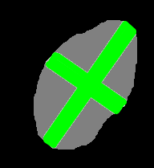
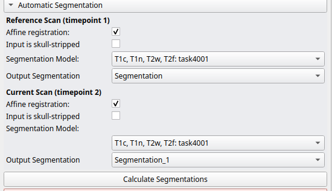

# RANO annotation tool

## Usage
1. Start 3D Slicer by clicking on the Slicer symbol: 

2. Start the RANO annotation plugin by clicking on the following symbol in the menu: 

3. Select the patient and time points in the Test Cases Box and click Load

This will load all required scans in the "Inputs" box

4. Automatic segmentation: make sure the "Affine registration" checkbox is checked
and the Input is skull-stripped checkbox is unchecked. Select the model "task4001" and
"Create new segmentation" under "Output Segmentation":

Click "Calculate Segmentation" to run the segmentation model.

5. In the "Automatic 2D Measurements" box choose one of the predicted segments
into which the orthogonal line pairs are to be placed:
