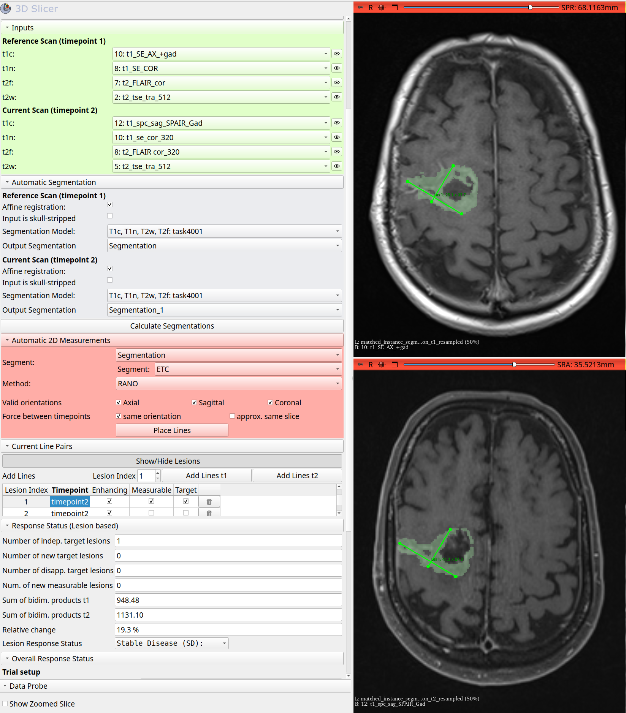

# RANO2.0-assist: A 3D Slicer Extension for (semi-)automatic Assessment of Response to Glioma Treatment

Click [here](https://cai4cai.github.io/rano2.0-assist/) to see the full documentation and community guidelines for how to contribute to RANO2.0-assist

### In a nutshell
The RANO2.0-assist is an interactive tool for Response Assessment in Neuro-Oncology (RANO). It is based on the RANO 2.0
guidelines and is designed to assist in the evaluation of glioma. The tool is implemented as a 3D Slicer extension and
provides a user-friendly interface for annotating and measuring tumor response in MRI scans. The pipeline includes
the following steps:
1. **Automatic Segmentation**: The tool uses deep learning models to automatically segment the tumor regions in the MRI scans.
2. **Lesion Matching**: Lesions are matched across different time points to assess changes longitudinally.
2. **Automatic 2D Measurements**: The tool provides automatic measurements of the segmented tumor regions, including
   the calculation of the bidimensional product.
3. **Manual Adjustments**: Users can manually adjust the automatically placed line pairs, add new line pairs, and
   remove unwanted ones.
4. **Response Assessment**: The tool provides a summary of the measurements and allows users to assess the response
   according to the RANO 2.0 guidelines, considering the bidimensional product as well as clinical criteria such as 
   steroid use and clinical status.
5. **Report creation:** The tool generates a report summarizing the measurements and response assessment, which can be 
   saved in PDF format.

