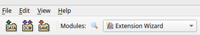
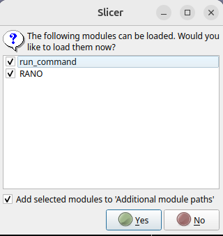
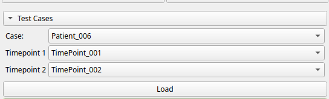
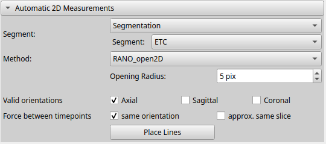
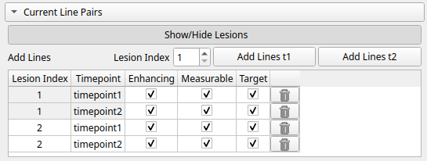
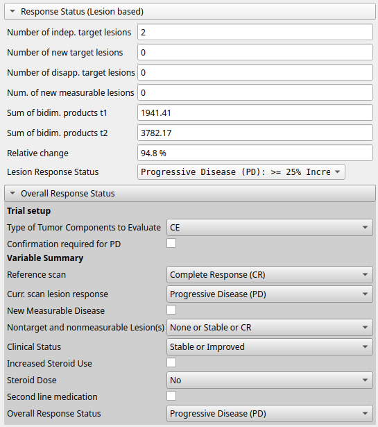

# RANO2.0-assist

The RANO2.0-assist is an interactive tool for Response Assessment in Neuro-Oncology (RANO). It is based on the RANO 2.0
guidelines and is designed to assist in the evaluation of glioma. The tool is implemented as a 3D Slicer extension and
provides a user-friendly interface for annotating and measuring tumor response in MRI scans. The pipeline includes
the following steps:
1. **Automatic Segmentation**: The tool uses deep learning models to automatically segment the tumor regions in the MRI scans.
2. **Lesion Matching**: Lesions are matched across different time points to assess changes longitudinally.
2. **Automatic 2D Measurements**: The tool provides automatic measurements of the segmented tumor regions, including
   the calculation of the bidimensional product.
3. **Manual Adjustments**: Users can manually adjust the automatically placed line pairs, add new line pairs, and
   remove unwanted ones.
4. **Response Assessment**: The tool provides a summary of the measurements and allows users to assess the response
   according to the RANO 2.0 guidelines, considering the bidimensional product as well as clinical criteria such as 
   steroid use and clinical status.
5. **Report creation:** The tool generates a report summarizing the measurements and response assessment, which can be 
   saved in PDF format.


# Installation

## System requirements
- **Operating System**: The tool has been tested on Ubuntu 24.04
- **GPU**: The tool requires a GPU with CUDA support for the automatic segmentation. The tool has been tested on
  NVIDIA GPUs with CUDA 12.4.

## Download the repository
The repository can be downloaded from GitHub: 

[https://github.com/cai4cai/rano2.0-assist](https://github.com/cai4cai/rano2.0-assist)

## Segmentation models and test data
The segmentation model weights and test data need to be downloaded from 

[https://zenodo.org/records/15411078](https://zenodo.org/records/15411078)

(direct download link: [click here](https://zenodo.org/records/15411078/files/rano2.0-assist.zip?download=1) )

and placed in the rano2.0-assist root directory:

This will add the following directories to the directory:
```
└── rano2.0-assist
    ├── data
    │   └── test_data
    │       ├── KCL
    │       │   └── Patient_003
    │       └── MU-Glioma-Post  # https://www.cancerimagingarchive.net/collection/mu-glioma-post/
    │           ├── PatientID_003
    │           └── PatientID_005
    └── dynunet_pipeline
        └── data
            └── tasks
                ├── task4000_brats24
                └── task4001_brats24allmod
```

## 3D Slicer extension
RANO2.0-assist can be installed as a local 3D Slicer extension, or it can be run in a Docker container. The Docker
container includes all the necessary dependencies and can be run on any machine with Docker installed that supports
GPU acceleration. The local installation requires 3D Slicer and the necessary Python packages to be installed.

### Installation with Docker
For Docker installation, follow instructions here: [docker/README.md](../../docker/README.md).

### Local installation

#### Software requirements
Follow the links to install the required software:
- [3D Slicer](https://download.slicer.org/) (tested with version 5.8.1)

The following Python packages can be installed in 3D Slicer's python environment. 
The versions listed below are the ones that have been tested with this extension.
To install the packages, you can either use the pip_install command in the 3D Slicer Python Console (e.g. 
type `pip_install("numpy==2.0.2")` in the console) or use the command line to install the packages in the 3D Slicer Python
environment as follow:

- numpy (tested with version 2.0.2): `pip_install("numpy==2.0.2")`
- scikit-image (tested with version 0.24.0): `pip_install("scikit-image==0.24.0")`
- numba (tested with version 0.60.0): `pip_install("numba==0.60.0")`
- nibabel (tested with version 5.3.2): `pip_install("nibabel==5.3.2")`
- tqdm (tested with version 4.67.1) : `pip_install("tqdm==4.67.1")`
- pyyaml (tested with version 6.0.2): `pip_install("pyyaml==6.0.2")`

The following packages are required for the segmentation pipeline (DynUNet). These can be installed either in the 3D Slicer
python environment or in a separate python environment whose path can be specified in the RANO module. The following 
commands are for installing the packages in the 3D Slicer python environment.
- PyTorch: check here which pip command is appropriate for your system (https://pytorch.org/get-started/locally/) (tested with version 2.6)
    - for example, in 3D Slicer's python console type: `pip_install("torch==2.6.0+cu124 torchvision==0.21.0+cu124 torchaudio==2.6.0+cu124 --index-url https://download.pytorch.org/whl/cu124")`
- MONAI (install from https://github.com/aaronkujawa/MONAI/tree/rano): `pip_install("git+https://github.com/aaronkujawa/MONAI.git@rano")`
- pytorch-ignite (tested with version pytorch-ignite 0.5.2): `pip_install("pytorch-ignite==0.5.2")`
- tensorboard (tested with version 2.19.0): `pip_install("tensorboard==2.19.0")`
- ANTsPy (tested with version 0.5.4): `pip_install("antspyx==0.5.4")`
- HD-BET (requires this specific commit): `pip_install("git+https://github.com/MIC-DKFZ/HD-BET@3e3d2a5993e8288f2eae928744ffb496cfc7c651")`

Note: if a separate python environment is used, numpy, scikit-image, numba, nibabel, tqdm and pyyaml need to be installed
in that environment on top of the installation in 3D Slicer.


#### Add the extension to 3D Slicer

To add the extension to 3D Slicer, follow these steps:
1. Open 3D Slicer and select "Developer Tools" --> "Extension Manager" in the Modules drop down menu or search for
   "Extension Manager" using the search tool.



2. In the Extension Manager, click "Select Extension" and select the "rano2.0-assist" repository folder.

3. Confirm the import of the two modules.



4. Start the RANO module by selecting "Tools" --> "RANO" in the Modules drop down menu or search for
   "RANO" using the search tool.


## Running tests
To test the docker installation, run the script [tests/run_tests_docker.sh](../../tests/run_tests_docker.sh)

To test the local installation, run the script [tests/run_tests.sh](../../tests/run_tests.sh)

Both scripts will start 3D Slicer and run the tests listed in run_tests.sh. By default one test runs on DICOM input data 
and another test runs on NIfTI input data. The tests are define in [RANO/utils/test_rano.py](../../RANO/utils/test_rano.py).

The tests will take a few minutes to run and will create tests in the `Reports` directory.

Upon successful completion, the script prints:
```
Test Summary:
Test test_RANO_dicom_KCL: PASSED
Test test_RANO_nifti_MU: PASSED

```


## Usage

### Running the tool
- Start 3D Slicer

- Start the RANO module by selecting "Tools" --> "RANO" in the Modules drop down menu or search for
  "RANO" using the search tool

### Loading the image data

#### 1. Loading the test data
- Loading the test data ist only available in developer mode. To enable developer mode, go to the "Edit" menu and select 
"Application Settings". 

- Under "Developer" tab, check the "Enable developer mode" checkbox. Restart of 3D Slicer is required.

- At the top of the RANO module, you will find the "Reload & Test" box, which is for developer use only.

- The "Test Cases" box allows you to load the test data saved under `data/test_data/KCL' in the repository.

- Select the patient and time points in the Test Cases Box and click "Load" to load the data. 



This will load all required scans in the "Inputs" box

#### 2. Loading your own data
- Drag and drop the MRI scans onto the 3D Slicer window. 3D Slicer will open a dialog to load the images.

- Alternatively you can follow the "Add Data" or "Add Dicom Data" buttons in the "Add Data" box. 

- After the images are loaded, select the volumes in the "Inputs" box. Note that all visible input channels
are required for automatic segmentation. The number of input channels is determined by the segmentation model that is
selected in the "Automatic Segmentation" box. The default model "task4001" requires 4 input channels:
  - T1c (T1 contrast enhanced)
  - T1 (T1 native)
  - T2f (T2 flair)
  - T2 (T2)

The other model "task4000" requires T1c only.


### Automatic segmentation

- Automatic segmentation: make sure the "Affine registration" checkbox is checked
and the "Input is skull-stripped" checkbox is checked if the input images have been skull-stripped already. For
both timepoints, select the model "task4001". The output segmentations by default are called "Segmentation_t1" and
"Segmentation_t2", but the user can also "Create new segmentations" under the dropdown menu. 


Click "Calculate Segmentation" to run the segmentation model.

- In the "Automatic 2D Measurements" box choose one of the predicted segments
into which the orthogonal line pairs are to be placed. By default, the enhancing segment (ETC) is selected.

- Choose the method. Currently the following methods are available:
    - RANO: No postprocessing of the segmentation. The method returns the line pairs that maximize the bidimensional product
      for each connected component of the selected segment.
    - RANO_open2D: A postprocessing is applied to "clean" the segmentation. A morphological opening with a circle of
      user-defined radius is applied along
      all 3 axes separately, and the union of the resulting segments is used as the new target area for the line pairs.
      Note: If the opening operation results in the splitting of a connecting component into multiple components, only
      one line pair is placed in that component in which the maximum bidimensional product is found.
    - RANO_open3D: A postprocessing is applied to "clean" the segmentation. A morphological opening with a sphere of
      user-defined radius is applied (once in 3D). The resulting segment is used as the segment for the line pairs.

- Choose the orientations along which the line pairs are to be placed. The default is "axial".
The user can also choose multiple orientations. The line pairs are then placed in 
that orientation in which the maximum bidimensional product is found.

- The "same orientation" checkbox assures that line pairs in the second timepoint are placed in the same orientation as 
in the first timepoint. 

- The "approx. same slice" checkbox assures that line pairs in the second timepoint are placed in approximately the same
slice as in the first timepoint. Note: This frequently leads to a slice of larger tumor extent to be missed in the second
timepoint and should be used with caution.

- Click "Place Lines" to automatically place the line pairs. 




### Manual adjustments of the line pairs
- The line pairs can be adjusted manually by clicking on the line pair control points and dragging them to the desired position.
- Changing the line pairs will automatically update the response classification further below in the GUI 
- Current line pairs are shown in the "Current Line Pairs" box. 
- The segmentation of the selected segment (after postprocessing) can be shown/hidden by clicking on the 
"Show/Hide Lesions" button



- Line pairs can be removed by clicking on the "Trash" icon
- New line pairs can be added by clicking on the "Add Lines t1" or "Add Lines t2" buttons. The lesion index has to be
  specified in the spin box next to the buttons.

### Response Status and Overall Response Status
- The initial response status based solely on the line pairs is shown in the "Response Status" box.
- The overall response status is shown in the "Overall Response Status" box and is additionally based on
the clinical criteria (steroid use and clinical status) that need to be specified by the user.




### Report creation
- The report can be created by clicking on the "Create Report" button in the "Report" box.
- A dialog will open to specify the report directory

### Other
- The "External Python Path" box allows the user to specify the path to a different python environment for the segmentation pipeline.
- If the specified path is not valid, the Slicer python environment will be used as a fallback.