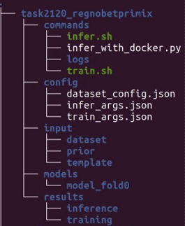

## Preparation of Model and Inference Data
1. Clone the [dynunet_pipeline](https://github.com/aaronkujawa/dynunet_pipeline) GitHub repository. (`git clone https://github.com/aaronkujawa/dynunet_pipeline.git`)
2. Download the [`data` folder](https://emckclac.sharepoint.com/:f:/r/sites/MT-BMEIS-M-F-P/Shared%20Documents/General/Models%20and%20Data/dynunet_pipeline/data?csf=1&web=1&e=E9bdwU)
that includes a subfolder `tasks` with one task folder for each model. Each task 
folder has the following structure:

   

   - `commands` contains scripts to run training and inference, where inference can also be run with the docker container.
   - `config` contains the dataset split (training, validation, inference) and labels (`dataset_config.json`) and parameters for the
training (`train_args.json`) and inference (`infer_args.json`).
   - `input` contains the images and labels of the dataset (`dataset`), split into training and testing data,
the input prior (`prior`) and the registration template (`template`)
   - `models` contains the trained models used for inference
   - `results` contains the results of model training and inference (note: after successful model training, the model
has to be copied/moved to the `models` folder to be used for inference)
3. Merge the `data` folder with the `data` folder in the repository root folder `dynunet_pipeline`

